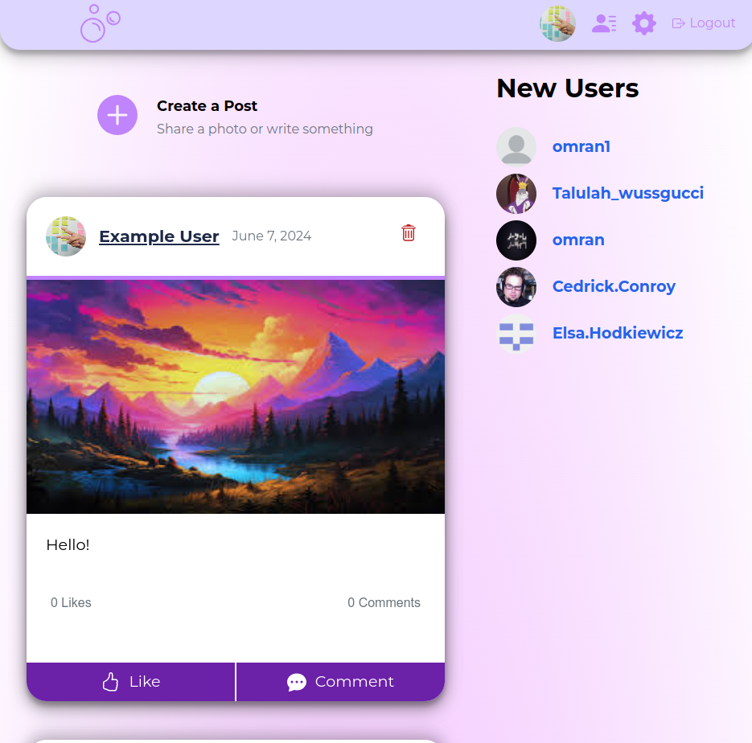

# bubbles

A social media app created as a fullstack portfolio project.

## Live Demo

Note: please make sure that your browser is able to store cookies

You can view the live demo of the project [here](https://bubbles-mern-15bcc2144c14.herokuapp.com/login).

## Built with

- React
- Express
- MongoDB/Mongoose
- Nodejs
- mostly custom CSS
- HTTP-only tokens
- Sendgrid Mail
- uploadthing
- bcryptjs
- react-spinners and react-toastify

## Features

- Sign up and log in with email
- Sign in as example user
- Email verification
- Send friend requests and approve or delete them
- Make Image or text-only posts
- Like posts
- Add comments
- Delete posts and comments
- Upload custom profile picture
- Edit 'About Me' section of profile
- Home page shows newsfeed of all the new posts
- Profile page shows your own posts and friends list
- 'New Users' shows newly signed up users to add as friends
- Change password
- fully resoponive in both desktop and phone screen sizes
